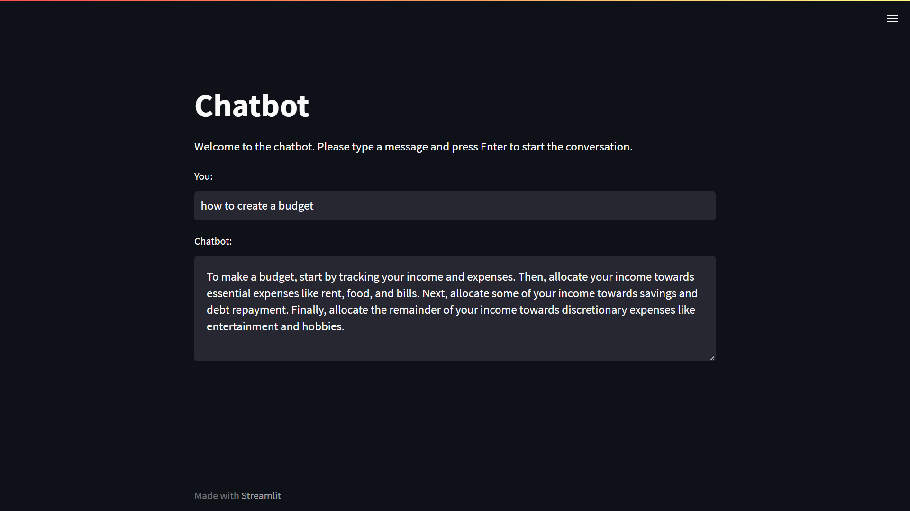

# Intents-Based Chatbot with Streamlit




# Project Overview
The project is divided into two parts:
1. NLP techniques and Logistic Regression algorithm is used to train the chatbot on labeled intents and entities.
2. For building the Chatbot interface, Streamlit web framework is used to build a web-based chatbot interface. The interface allows users to input text and receive responses from the chatbot.

# Getting Started
- To get started with this project, follow these steps:
1. Clone this repository to your local machine.
```
git clone https://github.com/xpert-codes/Chatbot-using-Natural-Language-Processing-NLP.git
```
1. Install the required Python libraries using:
```
pip install -r requirements.txt
```
3. Run streamlit app to launch the chatbot interface.
```
streamlit run app.py
```

# Streamlit Chatbot Interface
The chatbot interface is built using Streamlit. The interface includes a text input box for users to input their text and a chat window to display the chatbot's responses. The interface uses the trained model to generate responses to user input.